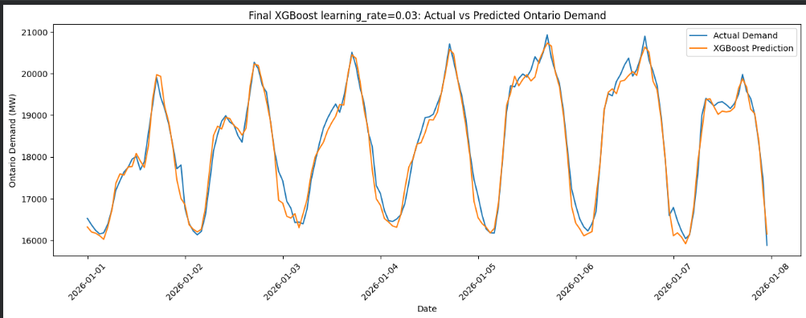
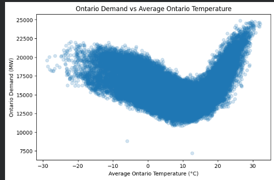

# Ontario Electricity Demand Forecasting

A machine learning project that forecasts next-hour Ontario electricity demand using historical demand, market demand, calendar features, Ontario holidays, and weather data.

## Open in Google Colab

[
## Project Overview

The goal of this project is to predict Ontario electricity demand for the next hour using time-series and weather-based features. The project compares multiple models against a simple persistence baseline to evaluate whether machine learning improves forecasting performance.

Models compared:

- Persistence baseline
- Ridge Regression
- Random Forest
- XGBoost

The final selected model was **XGBoost with `learning_rate=0.03`**, which achieved the lowest held-out test error.

## Final Results

| Model | MAE | RMSE | MAPE |
|---|---:|---:|---:|
| XGBoost `learning_rate=0.03` | 199.26 MW | 275.25 MW | **1.21%** |
| Random Forest `max_depth=10` | 232.95 MW | 318.86 MW | 1.40% |
| Ridge Regression + Sin/Cos Features | 283.17 MW | 392.40 MW | 1.73% |
| Baseline: Current Hour Demand | 420.97 MW | 555.00 MW | 2.55% |

The final XGBoost model achieved an approximate forecast accuracy of **98.79%** and reduced error by approximately **52.5%** compared with the persistence baseline.

## Visual Results

### Final XGBoost Forecast



The final XGBoost model closely tracked actual next-hour Ontario electricity demand on the 2026 test set.

### Weather and Demand Relationship



Electricity demand showed a nonlinear relationship with temperature. Demand increased during very cold and very hot conditions, supporting the use of weather-based features such as heating and cooling degree variables.

## Data Sources

This project uses:

- Ontario hourly demand data
- Ontario market demand data
- Historical weather data for Toronto, Ottawa, Windsor, Sudbury, and Thunder Bay
- Ontario holiday indicators generated using the Python `holidays` package

Weather data was collected and averaged across multiple Ontario cities to create a broader province-level weather signal.

## Features Used

The final model used the following types of features:

- Current Ontario demand
- Market demand
- Hour, day-of-week, and month features
- Sin/cos cyclical time features
- Weekend and holiday indicators
- Average Ontario temperature, humidity, apparent temperature, precipitation, and wind speed
- 1-hour, 24-hour, and 168-hour lag features
- 24-hour and 168-hour rolling demand averages
- Heating degree and cooling degree features

This is a **next-hour forecasting setup**, so current-hour demand is treated as available information when predicting the following hour.

## Modelling Approach

A time-based train/test split was used to evaluate whether the models generalized to future data.

- Training data: observations before 2026
- Test data: observations from 2026 onward

A target timestamp was created so the train/test split was based on the prediction target time rather than only the feature timestamp.

## Model Comparison

### Baseline

The baseline model predicted next-hour demand using current-hour demand. This was included because electricity demand is highly autocorrelated from one hour to the next.

### Ridge Regression

Ridge Regression was used as a regularized linear model. Sin/cos features were added so the model could better represent cyclical patterns such as hour of day, day of week, and month.

### Random Forest

Random Forest was tested as a nonlinear tree-based model. Several tree depths were compared. Although `max_depth=11` had a slightly lower test MAPE, `max_depth=10` was selected as a more conservative configuration because it had similar performance while limiting tree complexity.

### XGBoost

XGBoost was tested using multiple learning rates:

| Learning Rate | MAE | RMSE | MAPE | Best Iteration |
|---:|---:|---:|---:|---:|
| 0.03 | 199.26 | 275.25 | **1.21%** | 2246 |
| 0.01 | 206.17 | 283.04 | 1.25% | 2999 |
| 0.10 | 208.20 | 285.33 | 1.26% | 596 |
| 0.30 | 216.06 | 297.49 | 1.31% | 141 |

The learning rate of `0.03` achieved the best test performance and was selected as the final XGBoost configuration.

## Overfitting Check

Train and test errors were compared to evaluate generalization.

| Model | Train MAPE | Test MAPE | Gap |
|---|---:|---:|---:|
| Ridge Regression + Sin/Cos | 1.72% | 1.73% | 0.01 |
| Random Forest `max_depth=10` | 1.07% | 1.40% | 0.33 |
| XGBoost `learning_rate=0.03` | 0.87% | 1.21% | 0.34 |

The tree-based models showed a small train-test gap, suggesting mild overfitting. Additional regularization was tested, but it reduced the gap only slightly while increasing test error. Therefore, the original XGBoost model was selected because it provided the best overall balance between accuracy and generalization.

## Repository Structure

```text
ontario-electricity-demand-forecasting/
│
├── README.md
├── forecasting_github_final.ipynb
├── requirements.txt
├── .gitignore
│
├── images/
│   ├── final_xgboost_forecast.png
│   └── demand_vs_temperature.png
│
├── data/
│   ├── HFED_ Ontario MARKET_DEMAND data.csv
│   └── HFED_ Ontario ONTARIO_DEMAND data.csv
│
└── outputs/
    ├── ontario_demand_market_clean.csv
    ├── ontario_demand_market_holidays_weather.csv
    ├── ontario_demand_features_for_model.csv
    └── model_comparison_results.csv
```

## How to Run

1. Clone this repository.

```bash
git clone https://github.com/YOUR-USERNAME/ontario-electricity-demand-forecasting.git
cd ontario-electricity-demand-forecasting
```

2. Install the required packages.

```bash
pip install -r requirements.txt
```

3. Place the raw demand CSV files in the `data/` folder.

4. Open the notebook.

```bash
jupyter notebook forecasting_github_final.ipynb
```

Or upload the notebook to Google Colab and run all cells.

## Requirements

```text
pandas
numpy
matplotlib
scikit-learn
xgboost
holidays
requests
```

## Limitations

This project forecasts next-hour electricity demand, which is useful but relatively short-term because demand is highly correlated from one hour to the next.

Future improvements could include:

- Extending the model to 24-hour-ahead forecasting
- Adding more Ontario weather stations
- Weighting regional weather features by population or demand region
- Creating an interactive Streamlit dashboard
- Packaging the final model for batch prediction or cloud deployment

## Key Takeaway

XGBoost achieved the strongest forecasting performance, with a test MAPE of **1.21%**, outperforming Ridge Regression, Random Forest, and the persistence baseline. The model showed only a small train-test gap, indicating that it generalized well to unseen 2026 data.
